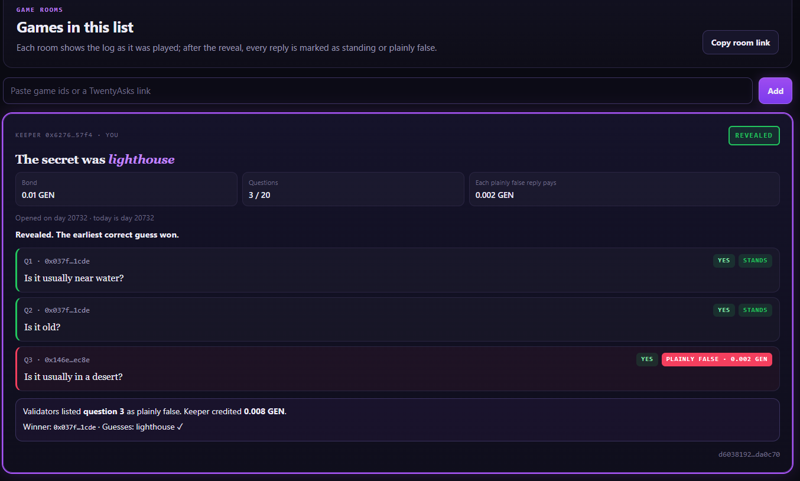

TwentyAsks does not guess the secret, and it does not referee the game while it is played. When the keeper reveals, it reads the whole log once for replies that are plainly false — and each one pays the player who was misled out of the keeper's bond.

<p align="center"></p>

# TwentyAsks

Twenty questions with a bond on the keeper's honesty, read once by GenLayer validators at the reveal. GenLayer StudioNet (chain 61999) · py-genlayer v0.2.

**The contract holds GEN.** While a game is open it holds the keeper's bond (0.001 to 1 GEN, sent with `open_game`).
When the game ends the bond becomes credits, and each wallet takes its own credit out with `withdraw`.

| | |
|---|---|
| Contract source | `contracts/HonestKeeper.py` (SHA-256 in `SOURCE_SHA256.txt`) |
| Project deployment | [`0x04A003704FDFAdE01D79213ab78B8D3c4c6CC0A2`](https://explorer-studio.genlayer.com/address/0x04A003704FDFAdE01D79213ab78B8D3c4c6CC0A2) |
| Intelligent Contract | HonestKeeper — the same frozen source, deployed separately at [`0x927633E550Ded8140e61FF9A4dD6e91Bc418E79f`](https://explorer-studio.genlayer.com/address/0x927633E550Ded8140e61FF9A4dD6e91Bc418E79f) |
| Live app | https://twenty-asks.vercel.app |
| Evidence | `RUNTIME_EVIDENCE.md` (one tx hash per row) · `TESTING.md` |

## What it does

A keeper commits to a secret item — only a hash of the item and a salt goes on chain — and stakes a bond. Players ask
yes/no questions one at a time; the keeper replies to each, and nobody can check a reply during play. When the keeper
reveals the item and the salt, validators read the **whole log once** with the revealed item and return one thing: the
positions whose reply is plainly false.

| Result | GEN |
|---|---|
| each listed position (the lowest five are paid) | `bond // 5` credited to the player who asked that question |
| the rest of the bond | credited to the keeper |
| no reveal within 3 days | any player who asked may forfeit: the bond is split equally among everyone who asked |
| the earliest correct guess | recorded as the winner (no GEN) |

On StudioNet, for `lighthouse`, one log held `Is it usually near water? — YES`, `Is it usually in a desert? — YES` and
`Is it old? — YES`. The reveal listed only **question 2**: the player who asked about the desert was credited 0.2 GEN of
a 1 GEN bond, the keeper kept 0.8 GEN, and the arguable "old" was left out. Through this app, with the desert question
asked third, the reveal listed **question 3** only: 0.002 GEN of a 0.01 GEN bond to the player it misled, 0.008 GEN to
the keeper.



Unusable or unclear output lists nothing, so an honest keeper is never penalised by a broken reading. A wrong salt cannot
reveal. Guesses stay hidden until the reveal.

## What the app shows

- **Overview**: how a reply stands, is plainly false, or is left out as arguable; the connected contract.
- **Game Rooms**: each game as a room — the keeper, the bond, the question count, the reveal deadline in days, whose turn
  it is, and the log with every YES/NO. After the reveal each reply is marked STANDS or PLAINLY FALSE with the GEN it
  paid, and the secret, the winner and the guesses appear. The keeper gets *Answer YES* / *Answer NO* and the reveal form;
  players get the question box (with a byte meter), one guess and, after the deadline, *Forfeit*. Every disabled button
  shows the contract's own sentence. The room link carries every game in the list.
- **Open a Game**: secret item, a salt generated in the browser, and the bond; the commitment and the game id are shown
  before you sign. This browser keeps the secret and salt for the reveal.
- **Credits**: your GEN held by the contract, and *Withdraw*.
- **Verification**: contract address, source SHA-256, the rubric hash, bond range and deadline read from `get_limits`.

After every write the app waits for consensus to accept it, re-reads the contract, and only then reports what happened —
for a reveal, which replies were listed and where the bond went.

## How to try it

You need **two wallets** on GenLayer StudioNet: a keeper with a little GEN, and a player. Nothing depends on existing data.

1. **Keeper** — *Open a Game*: secret `lighthouse` (or any everyday item), keep the generated salt, bond `0.01`. Copy the
   room link from *Game Rooms*.
2. **Player** — open the link and ask `Is it usually near water?`. **Keeper** — *Answer YES*.
3. **Player** — ask `Is it usually in a desert?`. **Keeper** — *Answer YES* (a deliberately false reply).
4. **Player** — guess `lighthouse`. **Keeper** — *Reveal* (the secret and salt are filled in): question 2 is marked
   PLAINLY FALSE and the player is credited 0.002 GEN; the keeper 0.008 GEN.
5. Both — *Credits* → *Withdraw*.

## Methods

| Write | Who | Checks, in order |
|---|---|---|
| `open_game(commitment_hex)` (payable) | anyone (becomes the keeper) | commitment 64 hex → bond 0.001–1 GEN → not opened before |
| `ask(game_id, question)` | anyone but the keeper | known id → ASKING → not the keeper → nothing pending → fewer than 20 → question 1–100 → no reserved token |
| `answer(game_id, yes)` | the keeper | known id → ASKING → keeper → a question is pending |
| `guess(game_id, word)` | anyone but the keeper, once | known id → ASKING → not the keeper → not guessed before → guess 1–40 |
| `reveal(game_id, secret, salt)` | the keeper | known id → ASKING → keeper → nothing pending → commitment matches → secret 1–40 → no reserved token → **the only model call** |
| `forfeit(game_id)` | a player who asked | known id → ASKING → the caller asked → 3 days since opening |
| `withdraw()` | any wallet with a credit | credit > 0 → zero, then send |

Views return JSON strings with amounts as decimal strings: `get_game`, `get_credits`, `get_rubric`, `get_limits`. The
full specification is in `LOCKED_SPEC.md`.

## Run locally

```bash
npm ci
npm run dev            # http://localhost:5173 (the /genlayer-rpc proxy is in vite.config.ts)
npm run build && npm test
npm run verify:source
python3 -m pytest tests/contract -q -p no:cacheprovider   # needs genlayer-test 0.29.2
```

`VITE_CONTRACT_ADDRESS` overrides the deployment address. On Vercel, `vercel.json` declares the same proxy.
`tools/ids.html` computes a commitment and a game id offline, for playing from GenLayer Studio.

## Honest limitation

1. **The contract holds GEN** — bonds of open games and credits nobody has withdrawn yet.
2. **"Plainly false" rests on the model's general knowledge of the item.** A rare word, or one with several meanings,
   weakens the reading.
3. **Arguable questions are not judged.** A keeper may answer them either way without penalty.
4. **A wrong listing is the main risk** — an honest keeper loses part of the bond. Nets: only plainly false replies are
   listed, and broken output lists nothing.
5. **Lose the salt, lose the reveal.** The app keeps it in this browser; a keeper who clears it and did not copy it
   cannot reveal, and the players may forfeit after three days.
6. **Days come from the transaction's time**, not the players' clocks. Guesses are compared as text (case and spaces
   aside), so a synonym is not a correct guess.
7. **One keeper can play a player from a second wallet**; the contract does not prove that a wallet is a person.

License: MIT.
