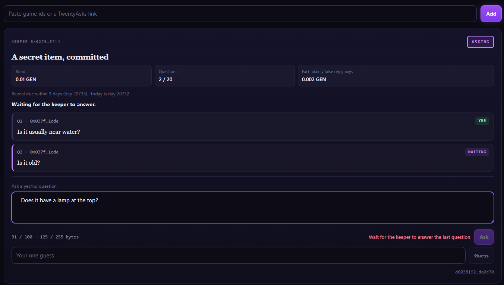
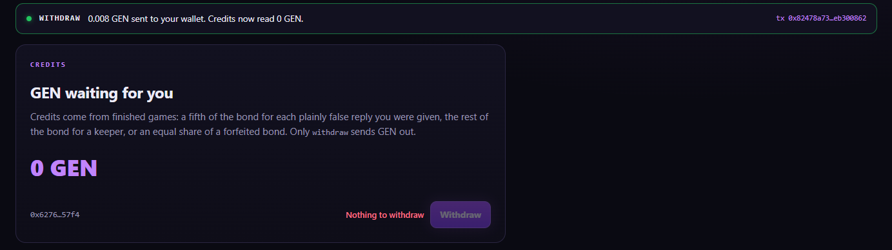

# RUNTIME_EVIDENCE

```
COMPILE PASS ≠ RUNTIME PASS
SUBMITTED ≠ ACCEPTED ≠ FINALIZED ≠ EXECUTION SUCCESS ≠ POSTCONDITION PASS
```

Both deployments run the same frozen source, SHA-256 `3d305aa934825304c32905452d806c9ba22cbb8d470e3fed491ff25afae009ea`.

## Project run (address `0x04A003704FDFAdE01D79213ab78B8D3c4c6CC0A2`, through this app)

Run date 2026-10-06, app at https://twenty-asks.vercel.app, MetaMask on StudioNet. Deploy tx [`0xf437a6b2…dc879e6a`](https://explorer-studio.genlayer.com/tx/0xf437a6b21ae9f13a413c3e876b757af40cc18a8ce4fa88d7e2c5c4e2dc879e6a). **11 transactions** sent from the app, all FINALIZED with SUCCESS, plus the GEN transfers the contract emitted on the two withdrawals (shown as *Send* on the [contract page](https://explorer-studio.genlayer.com/address/0x04A003704FDFAdE01D79213ab78B8D3c4c6CC0A2), e.g. [`0x270ee81a…d56783f0`](https://explorer-studio.genlayer.com/tx/0x270ee81aa40403d4d6975670b6bb2be3eba3422a90e2139825acb2f4d56783f0)).

Wallets: **A** = keeper `0x6276095FAEA15108740445ff277fdA8c304657F4` · **B** = player 1 `0x037f58E33c1Ec8fdA272361E0aAC1e31054a1CDE` · **C** = player 2 `0x146e44881d35814bA582D265AF5b97ef2695ec8e`.
Game `d6038192925e5c5fc29a264e65783ce93835bc44696893589ca7e95ba3da0c70` — secret `lighthouse`, a 32-character salt generated by the app, bond 0.01 GEN (the commitment and the game id were shown before signing).

| # | Wallet | Action in the app | Tx hash | Result (read back by the app from the accepted state) |
|---|---|---|---|---|
| P1 | A | Open a game, bond 0.01 GEN | [`0xbeaf43a3…b36c186f`](https://explorer-studio.genlayer.com/tx/0xbeaf43a3c7d6606b31e7a54e9a45c69de31bae87272ef79cc18f8bbab36c186f) | ASKING, opened day 20732, reveal due by day 20735 |
| P2 | B | Ask `Is it usually near water?` | [`0xdefa5733…c1894d76`](https://explorer-studio.genlayer.com/tx/0xdefa57335ca71808787269de0782d2bd92ed8f4f92e7a121afc5ba21c1894d76) | "Question 1 asked" |
| P3 | A | Answer YES | [`0x8e4f557f…767d6cdc`](https://explorer-studio.genlayer.com/tx/0x8e4f557f9818de41d6c2adc3095acd1add628ad9de1674078e92fef5767d6cdc) | "You answered YES to question 1" |
| P4 | B | Ask `Is it old?` | [`0xb0e8c4de…59e57963`](https://explorer-studio.genlayer.com/tx/0xb0e8c4de09d4522123a7d74a5028b50a29fce7dfa776e69c0ac3305759e57963) | question 2 waiting |
| P5 | C | Ask box while question 2 waits | — (not sent) | *Ask* disabled with *Wait for the keeper to answer the last question* (screenshot 2) |
| P6 | B | Guess `lighthouse` | [`0x40fcc65e…d5a1d752`](https://explorer-studio.genlayer.com/tx/0x40fcc65eb46b9958f907bb2cf373cf2a5807b9d68809cabe5aa01b7ad5a1d752) | "Guess recorded"; 1 guess in, hidden |
| P7 | A | Answer YES (question 2) | [`0x708ff253…67b9b684`](https://explorer-studio.genlayer.com/tx/0x708ff2535f2dfdc737329f356703cd7a192be6f09288583ef4f1880567b9b684) | question 2 YES |
| P8 | C | Ask `Is it usually in a desert?` | [`0xae9c249b…9647a4f4`](https://explorer-studio.genlayer.com/tx/0xae9c249b3e86ba6640bc86827538bf9dca3c788c15568e67a19bc22d9647a4f4) | "Question 3 asked" |
| P9 | A | Answer YES (question 3, a deliberately false reply) | [`0x1859f4d5…da90c789`](https://explorer-studio.genlayer.com/tx/0x1859f4d5473d8f71fabdb5b0626db3f2eddae3ad057d622c114d2923da90c789) | question 3 YES |
| P10 | A | Reveal (secret and salt filled from the browser) | [`0x4245e4a6…d89f2eb0`](https://explorer-studio.genlayer.com/tx/0x4245e4a69b7fbda694d629d3c071c152b7731993e159a4cc0c018c17d89f2eb0) | **REVEALED; validators listed question 3 only** — the desert reply PLAINLY FALSE, paid 0.002 GEN to C; near water and old STANDS; keeper credited 0.008 GEN; winner B (screenshot 1) |
| P11 | C | Withdraw | [`0x19a12bb8…9f708d82`](https://explorer-studio.genlayer.com/tx/0x19a12bb8326e825e25cf19a8c012d025feccefdbf0aac55b8c70d7019f708d82) | "0.002 GEN sent to your wallet. Credits now read 0 GEN." |
| P12 | A | Withdraw | [`0x82478a73…eb300862`](https://explorer-studio.genlayer.com/tx/0x82478a735e904eb6ce31bb1575ebd8ece10bbe67c32630c86c2968feeb300862) | "0.008 GEN sent to your wallet. Credits now read 0 GEN." (screenshot 3) |

The app reports a reveal only after re-reading the game and the keeper's credits: every question's flag matches the list,
the listed question carries `bond // 5`, and the keeper's credit grew by exactly the rest (`src/lib/verify.ts`).

Note from the run: the planned order put the desert question second; it was asked third, after "Is it old?" and B's
guess. The log and the outcome are the same in kind — one true reply, one arguable reply and one plainly false reply,
and only the false one was listed.

Screenshots:






Also: `docs/evidence/3a-player-withdrew.png` (C withdrew 0.002 GEN).

## Intelligent Contract run (address `0x927633E550Ded8140e61FF9A4dD6e91Bc418E79f`, Studio)

Contract [`0x927633E550Ded8140e61FF9A4dD6e91Bc418E79f`](https://explorer-studio.genlayer.com/address/0x927633E550Ded8140e61FF9A4dD6e91Bc418E79f) · deploy tx [`0x8734a4cf…992fc58f`](https://explorer-studio.genlayer.com/tx/0x8734a4cfeccbd625813ac429c538393c63a68d6b5d31a460419e0ecd992fc58f) · source SHA-256 `3d305aa934825304c32905452d806c9ba22cbb8d470e3fed491ff25afae009ea`. Run date 2026-10-06, GenLayer Studio, Normal (Full Consensus). **16 transactions** sent by the test wallets (deploy included), all FINALIZED, every one listed below, plus the 2 GEN transfers the contract itself emitted on `withdraw`.

Wallets: **A** = keeper `0x6276095FAEA15108740445ff277fdA8c304657F4` · **B** = player 1 `0xAD05365aFe0C2450d4FFBcdbE555b6E5fB7Dfa35` · **C** = player 2 `0xA2D2E7baD15e7b8A9031d88353530a794e56Db28`.

One game, secret `lighthouse`, committed with the 32-character salt `k3Rv8pQz1Lw6Tn0Yh5Xc2Bm9Df4Gs7Ja` (commitment `276c67646c7e64be52612329b188da32c42bc1cb5ea2d5772866279f028fba41`), game id **G** = `33dc9b684fbc4397db21dc1d1d3fd3f44579905554ebfcbc443d9163b60ea590`. H4 (a true reply), L4 (a plainly false reply) and the arguable U2 sit in the same log and are judged in one reading at the reveal; only L4 may be listed. The other cases are measured offline (rubric gate, calldata). **Bond 1 GEN** (GenLayer Studio's value field takes whole GEN; 1 GEN is the contract's maximum bond), so one listed reply pays 0.2 GEN.

| # | Wallet | Call | Expected | Tx hash | Result (read back with `get_game` / `get_credits`) |
|---|---|---|---|---|---|
| 0 | A | deploy | — | [`0x8734a4cf…992fc58f`](https://explorer-studio.genlayer.com/tx/0x8734a4cfeccbd625813ac429c538393c63a68d6b5d31a460419e0ecd992fc58f) | SUCCESS |
| 1 | A | `open_game("276c6764…8fba41")` + value 1 GEN | G is ASKING, bond 10^18 wei; `today` = `opened_day`, deadline = opened_day + 3 — **Clock check** | [`0x7b8e74ea…6cd26755`](https://explorer-studio.genlayer.com/tx/0x7b8e74ea1c46bd7151595323c11bdb4d9c5eb03505b4720e3da20eef6cd26755) | SUCCESS; ASKING, bond_wei `1000000000000000000`, opened_day **20732** = today **20732** (2026-10-06), reveal_deadline_day **20735**, deadline_passed false, lie_share_wei `200000000000000000` |
| 2 | B | `ask(G, H4)` | question 1 pending | [`0x8d09c4b3…27542a07`](https://explorer-studio.genlayer.com/tx/0x8d09c4b37010ea088978a44d235135703d7259dc0326345c5552b2f327542a07) | SUCCESS |
| 2x | B | `answer(G, true)` — **sent from B by mistake** | — | [`0xc8d996e2…39f55fa7`](https://explorer-studio.genlayer.com/tx/0xc8d996e252ae69e0d10bb537434b0a4db3e1f8b25a786f2ef00c4d0439f55fa7) | reverted, *Only the keeper may answer*; nothing changed. Resent from A in the next line |
| 2 | A | `answer(G, true)` | question 1 answered YES | [`0xbef48223…3c7e68c2`](https://explorer-studio.genlayer.com/tx/0xbef482237671e8463d6f501d7a17e1d8fe620cae236072d6eb13ff003c7e68c2) | SUCCESS; q_count 1, pending false, question 1 YES, asker B |
| 3 | C | `ask(G, L4)` | question 2 pending | [`0x76ccd7b8…fd557699`](https://explorer-studio.genlayer.com/tx/0x76ccd7b8ec6b317e40061eaf8447f0cb18a774910ffb9773ead33ad0fd557699) | SUCCESS |
| 3 | A | `answer(G, true)` | question 2 answered YES — a deliberately false reply | [`0x0c45a278…2d49c638`](https://explorer-studio.genlayer.com/tx/0x0c45a278f37ac81fc6f54f0644f1a71a02760a87063ea55a086b97bd2d49c638) | SUCCESS |
| 4 | B | `ask(G, U2)` | question 3 is pending | [`0x8357fa26…617512e2`](https://explorer-studio.genlayer.com/tx/0x8357fa26cd48c6ad7342205f59f9d3136fa66bdf00ff3e08649aa8f8617512e2) | SUCCESS; q_count 3, pending true, question 2 YES (asker C), question 3 not yet answered |
| 5 | C | `ask(G, "Does it have a lamp at the top?")` | revert *Wait for the keeper to answer the last question* | [`0xe07b0463…5963ae77`](https://explorer-studio.genlayer.com/tx/0xe07b04631e65f366740e5123d6b33b8ca2bd957b3bb29d2e2a79803e5963ae77) | reverted, *Wait for the keeper to answer the last question* |
| 6 | A | `answer(G, true)` | question 3 answered YES (an arguable question) | [`0xcea0c38d…1815191f`](https://explorer-studio.genlayer.com/tx/0xcea0c38d5bd44a98ff0343e27f6f6cdc302f5e5f67c11f0df8cc76751815191f) | SUCCESS |
| 7 | B | `guess(G, "lighthouse")` | guess recorded, text hidden | [`0xcd1da5a1…745e2744`](https://explorer-studio.genlayer.com/tx/0xcd1da5a16e1da5b2d0b0d6f4c35b0a46621199674ce49566f428aff8745e2744) | SUCCESS; guess_count 1, guesses `[]`, pending false |
| 8 | A | `reveal(G, "lighthouse", "…Gs7Jb")` | revert *The revealed secret does not match the commitment* (wrong last character of the salt) | [`0xe6fd014a…032f2486`](https://explorer-studio.genlayer.com/tx/0xe6fd014a2d6055a4b5af10f3a078d6350577bec307f62f601ab94a56032f2486) | reverted, *The revealed secret does not match the commitment* |
| 9 | A | `reveal(G, "lighthouse", "…Gs7Ja")` | REVEALED; lies == [2], winner B; credits C = 0.2 GEN, A = 0.8 GEN — **Check 1, Check 2** | [`0x6806c3e5…56a77d33`](https://explorer-studio.genlayer.com/tx/0x6806c3e5db9fa4a486a436ba1184405b3714fe8b5af949560f9b876056a77d33) | **`lies` [2]** (validators' agreed output `{"lies":[2]}`); REVEALED, winner B, keeper_credit_wei `800000000000000000`; `get_credits(C)` = `200000000000000000`, `get_credits(A)` = `800000000000000000` |
| 10 | C | `withdraw()` | GEN sent to C, credit 0 — **Payout check** | [`0xf2c60409…3efb777b`](https://explorer-studio.genlayer.com/tx/0xf2c604099566f1cf195c9484f9ce47056395680e3c3805911ed547ae3efb777b) | SUCCESS; `get_credits(C)` = `0` |
| 10 | A | `withdraw()` | GEN sent to A, credit 0 — **Payout check** | [`0x4d35a738…f44d3493`](https://explorer-studio.genlayer.com/tx/0x4d35a7380ed986c945cbe9332fb6fdf3b7c04b3f6c221a20a574e4eff44d3493) | SUCCESS; `get_credits(A)` = `0` |
| 11 | B | `ask(G, "Is it a building?")` | revert *This game is over* | [`0x3d8087e5…14f67a93`](https://explorer-studio.genlayer.com/tx/0x3d8087e5ff88ce7e21cbb760916de20d7c91677b942b91237826e52614f67a93) | reverted, *This game is over* |
| 12 | — | `get_game(G)` | read | — (read) | REVEALED, secret `lighthouse`, lies [2]; question 1 lie false, **question 2 lie true, paid_wei `200000000000000000`**, question 3 lie false; winner B; guesses: B `lighthouse`, correct true |

Transfers emitted by the contract on the two `withdraw` calls (shown as *Send* from the contract address on the explorer): [`0x04879bec…27dcbd1c`](https://explorer-studio.genlayer.com/tx/0x04879bec58d157f587dd51a6b3ea0043593ca84d742d56f9647399bc27dcbd1c), [`0x2f105ed9…9dd1e00b`](https://explorer-studio.genlayer.com/tx/0x2f105ed9c6f6f4bdad8510f98e19c5e59c563e4e120cd731767f25429dd1e00b).

Must-verify rows:

- **Clock check** — get_game after row 1 returns today and opened_day as plausible day numbers (20732 = 2026-10-06): **PASS**
- **Check 1** — the reveal lists exactly the position of the plainly false reply (question 2) and neither the true reply nor the arguable one (row 9): **PASS**
- **Check 2** — the player who asked question 2 (C) is credited bond // 5 = 0.2 GEN and the keeper the rest, 0.8 GEN (row 9): **PASS**
- **Payout check** — withdraw moves GEN out of the contract (two outgoing transfers) and zeroes both credits (row 10): **PASS**

Notes from the run:

- Row 2x was a slip: the keeper's first `answer` was sent from wallet B and reverted with *Only the keeper may answer* — the keeper-only check working on-chain. Nothing changed; the same call was then sent from A.
- The bond is 1 GEN rather than the planned 0.005 GEN because GenLayer Studio's value field takes whole GEN. All shares scale with it (bond // 5 = 0.2 GEN).
- Wallet balances before and after `withdraw` were not captured; the evidence is the two transfers emitted by the contract and both credits read back as 0.
